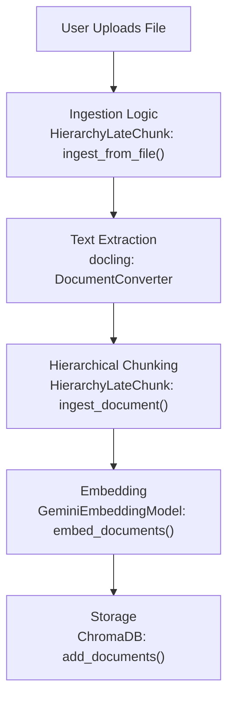
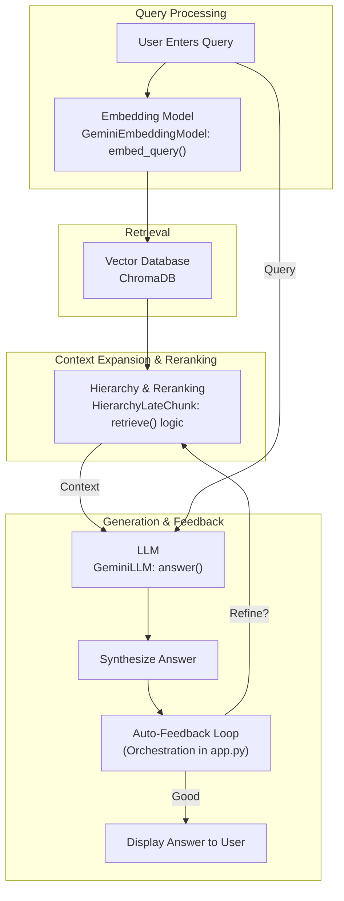

# Workflow

This document outlines the two main workflows in the application: data ingestion and query retrieval.

## Data Ingestion Flow

This chart illustrates the process from uploading a document to storing it in the vector database.

## Query and Retrieval Flow

This chart illustrates the process from a user query to the final answer, including the retrieval and synthesis steps.

## 6. Optimization & Speed Improvements (v3)
- **Parallel Retrieval Execution**: Query Expansion, HyDE Generation, and Embedding are now run simultaneously using `ThreadPoolExecutor`.
- **Cached Embeddings**: To prevent redundant API calls, query and HyDE embeddings are stored in the state.
- **Batched DB Queries**: Chunk retrieval now uses a single batched query (using `$in` operator) instead of iterative lookups.
- **Lazy Loading**: Heavy libraries like `docling` are imported only inside ingestion methods to speed up retrieval startup.

## 7. Retrieval Logic (Detailed)
1. **Parallel Launch**: The system starts 3 tasks at once:
   - Embed Original Query.
   - Generate & Embed HyDE Answer (Hypothetical Document).
   - Generate & Embed Expanded Queries (Synonyms/Related terms).
2. **Vector Fusion**: It calculates the **mean** of all these vectors (Original + HyDE + Expansions) to create a single "Super-Vector".
3. **Hierarchical Search**:
   - Uses the Super-Vector to find relevant **Sections**.
   - Uses the Super-Vector + Section ID filter to find specific **Chunks**.
4. **Ranking**: Results are reranked (using Jina Reranker) before being sent to the LLM.

## 8. Evaluation & Testing
- **Run Eval**: `python evaluate/run_eval.py`
  - checks for existing vector store (skips ingestion if found).
  - runs a set of Q&A pairs defined in `evaluate/eval.toml`.
  - auto-grades answers logic using an LLM evaluator.
  - saves results to `evaluate/eval_result.json`.
